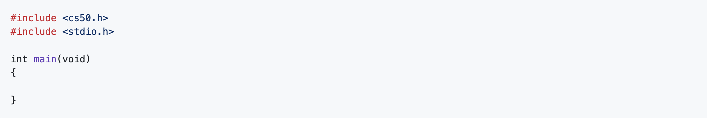
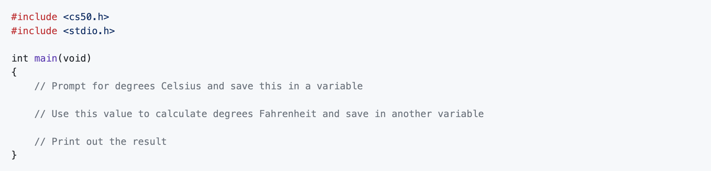
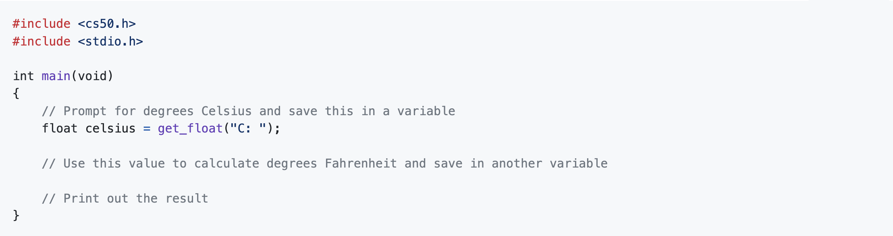

# Fahrenheit

## tl;dr

Implement a program that converts degrees in Celsius to Fahrenheit, per the below.

```
$ ./fahrenheit
C: 50.7
F: 123.3
```

## Turning Up The Heat

In the past, if you wanted to know what the outdoor temperature was, you had to look around for one of these, which might have been mounted outside at your house.


Prior to that, you just stood outside, but we digress. Nowadays, it’s a fairly trivial exercise to pull open a weather app on your phone or visit a weather-reporting website to get the current temperature and the five-day forecast. No need to mess around with one of the above circular dials or its tube-of-mercury cousin.

In practically every other country of the world (or if you live in the United States and do in fact spend most of your day working in a science lab), you’re probably most familiar with the Celsius or centigrade scale. In that case, if you hear that it’s 30° outside you’re probably going to rummage through your closet for a swimsuit and put on some sunblock, because it’s a beautiful beach day. On the Celsius scale, 0° is the freezing point of water, and 100° is the boiling point.

We acknowledge that with most apps that tell you the weather, it’s fairly simple to press that switch that switches the temperature display from Fahrenheit to Celsius (or vice versa), but before that process was automated for us, one either had to memorize some of the more common conversion points or had to use a mathematical formula to convert from one scale to another, which is important if you plan on traveling internationally.

For this problem, we’re going to focus on converting in just one direction: from Celsius to Fahrenheit. As it happens, the formula for this conversion isn’t terribly complex. (Phew!) One simply takes the current temperature in degrees Celsius (°C), multiplies it by 9, divides by 5, and then adds 32. The result is the equivalent temperature in degrees Fahrenheit (°F). Not bad, right? For the more visually inclined, this translates to this formula:

```
F = ((C * 9) / 5) + 32
```

Let’s do a quick test to make sure things work as expected. Worldwide, the commonly accepted value for normal human body temperature is 37°C. If we plug "37" into that formula where °C goes and do the math (37 multiplied by 9 is 333, 333 divided by 5 is 66.6, 66.6 + 32 is 98.6) we get 98.6°F which is what folks in the United States know as normal human body temperature. So that checks out. Similarly if we plug in 0°C (the freezing point of water) into that formula does it convert to 32°F, and 100°C (the boiling point of water) is apparently equivalent to 212°F. Seems like things are going well.

So your job is to write a program that converts a temperature in Celsius to Fahrenheit, as per the sample output below, wherein the "100" represents some user’s input.

```
$ ./fahrenheit
C: 100
F: 212.0
```

## Demo


## Getting Started

Log into [cs50.dev](https://cs50.dev) using your GitHub account. 

Execute `cd` by itself in your terminal window. You should find that your terminal window’s prompt resembles the below:

```
$
```

Next execute

```
mkdir fahrenheit
```

to make a folder called `fahrenheit` in your codespace.

Then execute

```
cd fahrenheit
```

to change directories into that folder. You should now see your terminal prompt as `fahrenheit/ $`. You can now execute

```
code fahrenheit.c
```

to create a file called `fahrenheit.c` in which you can write your code.

## Advice
<details>
  <summary>
    <span style="font-weight: bold;">
    Write some code that you know will compile
    </span>
  </summary>
<br>
<p>Even though this program won’t do anything, it should at least compile with make!</p>
  
<!--  
```c
#include <cs50.h>
#include <stdio.h>

int main(void)
{

}
```
-->



</details>

<details>
  <summary>
    <span style="font-weight: bold;">
    Write some pseudocode before writing more code
    </span>
  </summary>
<br>
<p>If unsure how to solve the problem itself, break it down into smaller problems that you can probably solve first. For instance, this problem is really three small problems:</p>

<ol>
  <li>Prompt for degrees Celsius and save this in a variable</li>
  <li>Use this value to calculate degrees Fahrenheit and save in another variable</li>
  <li>Print out the result</li>
</ol>

<p>So write some pseudcode as comments that remind you to do just that:</p>

<!--  
```c
#include <cs50.h>
#include <stdio.h>

int main(void)
{
    // Prompt for degrees Celsius and save this in a variable

    // Use this value to calculate degrees Fahrenheit and save in another variable

    // Print out the result
}
```
-->



</details>


<details>
  <summary>
    <span style="font-weight: bold;">
    Convert the pseudocode to code
    </span>
  </summary>
<br>
<p>First consider what datatype the variable that holds degrees Celsius should be. Since we may want to enter a number with a decimal for degrees Celsius, we need to use a `float`. So go ahead and declare a new `float` as below, and use `get_float` to prompt the user for a value. </p>

<!--  
```c
#include <cs50.h>
#include <stdio.h>

int main(void)
{
    // Prompt for degrees Celsius and save this in a variable
    float celsius = get_float("C: ");

    // Use this value to calculate degrees Fahrenheit and save in another variable

    // Print out the result
}
```
-->



<p>Then declare another float to hold degrees Fahrenheit, and assign the result of the temperature conversion formula (given above).</p>

<p>Finally, print out the result with exactly one decimal place.</p>

</details>

<details>
  <summary>
    <span style="font-weight: bold;">
    Forget how to print?
    </span>
  </summary>
<br>
  
<p>Printf can be used to specify how many places after the decimal point you wish to display to the user. For example to print a float with 2 decimal places you would type:</p>

```c
printf("%.2f\n", number);
```

<p>Can you see why this prints with 2 decimal places? Now adapt this to print degrees Fahrenheit (don't forget to start the output with "F: ") to exactly one decimal place.</p>

</details>

## Compiling and Executing

Remember you must compile your code to convert it to binary code before you can execute it!

Compile with:

```
make fahrenheit
```

Execute as below:

```
./fahrenheit
```

If you get errors when attempting to compile, and you aren't sure how to solve, copy and paste the error code into the CS50 Duck!


## Testing
### Correctness
Execute the below to evaluate the correctness of your code using check50, a command-line program that will output happy faces whenever your code passes CS50’s automated tests and sad faces whenever it doesn’t! But be sure to compile and test it yourself as well!

```
check50 cs50/problems/2019/ap/fahrenheit
```

### Style

Execute the below to evaluate the style of your code using `style50`, a command-line program that will output additions (in green) and deletions (in red) that you should make to your program in order to improve its style. 

```
style50 fahrenheit.c
```

If not, don’t worry: it’s just time for a little bit of debugging and/or cleaning up your code.

## How to Submit

In your terminal, execute the below to submit your work.

```
submit50 cs50/problems/2019/ap/fahrenheit
```

You may resubmit any problem as many times as you’d like before the deadline.

Your submission should be graded for correctness within 2 minutes, at which point your score will appear at submit.cs50.io!

This was Fahrenheit.
