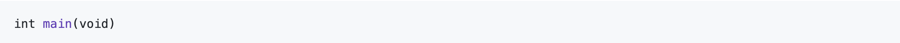
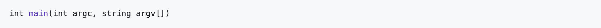
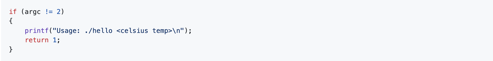

# Old Friends: Fahrenheit

In Fahrenheit you were asked to write a program that asked the user for a temperature in Celsius (which they provided via get_float) and which then printed out the equivalent temperature on the Fahrenheit scale.

```
$ ./fahrenheit
C: 0
F: 32.0
```

In this program's distro code, `fahrenheit.c`, you will find a fully-functioning version of the code you were tasked with writing in that problem. Convert that program so that it accepts the Celsius temperature from the command line instead.

```
$ ./fahrenheit 0
F: 32.0
```
## Chill Out

There’s a catch, though.

Just because the user types a real number at the prompt, that doesn’t mean their input will be automatically stored in a `float`. Actually, it will be stored as a string that just so happens to look like an float; after all, remember the data type of `argv`? It’s an array where each element is a `string`! And so you’ll need to convert that `string` to an actual float. As luck would have it, a function, `atof`, exists for exactly that purpose! Here’s how you might use it:

```c
float celsius = atof(argv[1]);
```

Notice, this time, we’ve declared `celsius` as an actual `float` so that you can do some arithmetic with it. Incidentally, you can assume that the user will only type real numbers at the command line.

Because `atof` is declared in `stdlib.h`, you’ll want to `#include` that header file atop your own code. And, as with `hello.c` earlier, you’ll want to make sure the user provides exactly the correct number of command-line arguments to your program before doing any calculations, returning 1 should they fail to.


Here is Doug's short video on command-line arguments again in case you missed it in Old Friends: Hello!

<style type="text/css">
.iframe_container {
	position: relative;
	padding-bottom: 56.25%; 
	padding-top: 25px;
	height: 0;
	margin-bottom: 30px;
}

.iframe_container iframe {
	position: absolute;
	top: 0;
	left: 0;
	width: 100%;
	height: 100%;
}
</style>

<div class="iframe_container">
  <iframe allow="accelerometer; autoplay; encrypted-media; gyroscope; picture-in-picture" allowfullscreen="" class="border" data-video="" src="https://www.youtube.com/embed/AI6Ccfno6Pk?si=nIteWlfkzUcaRLuV?modestbranding=0&amp;rel=0&amp;showinfo=0&amp;start=74" scrolling="no" id="iFrameResizer0" style="overflow: hidden;"></iframe>
</div>

## Getting Started

First:

```
cd oldfriends
```

to change directories to the folder you created in your first `old-friends` program

Then execute:

```
wget https://raw.githubusercontent.com/cs50nestm/programs/main/old-friends-fahrenheit/fahrenheit.c
```

to download your distro code.

You should now see the orignial verison of `fahrenheit.c` in your `oldfriends` directory. Let's change it to use command-line arguments.

Remember how to get started? You'll have to change the main function to be able to accept command line arguments.

<details>
  <summary>
    <span style="font-weight: bold;">
    Hints
    </span>
  <br>
  </summary>

<br>	
<p>Recall that our programs are capable of knowing information about what the user typed at the command line by modifying the way we write the start of our main function. Instead of</p>



<p>if we start main off by typing</p>



<p>we then have access to two special variables that we can use inside of main. First is <code>argc</code>, which is an integer variable that tells us how many things the user typed in at the command line, and second is <code>argv</code>, which is an array of strings representing exactly what the user typed.</p>
</details>

<br>	

Remember how to check for the correct number of command line arguments?

<details>
  <summary>
    <span style="font-weight: bold;">
    Hints
    </span>
  </summary>
 <br>
 
</details>


## How to Test

If you’d like to check the correctness of your program with check50, you may execute the below.

```
check50 cs50/problems/2019/ap/friends/fahrenheit
```

## How to Submit

Even thought this is a practice problem, please do submit to show you've completed this.

```
submit50 cs50/problems/2019/ap/friends/fahrenheit
```

